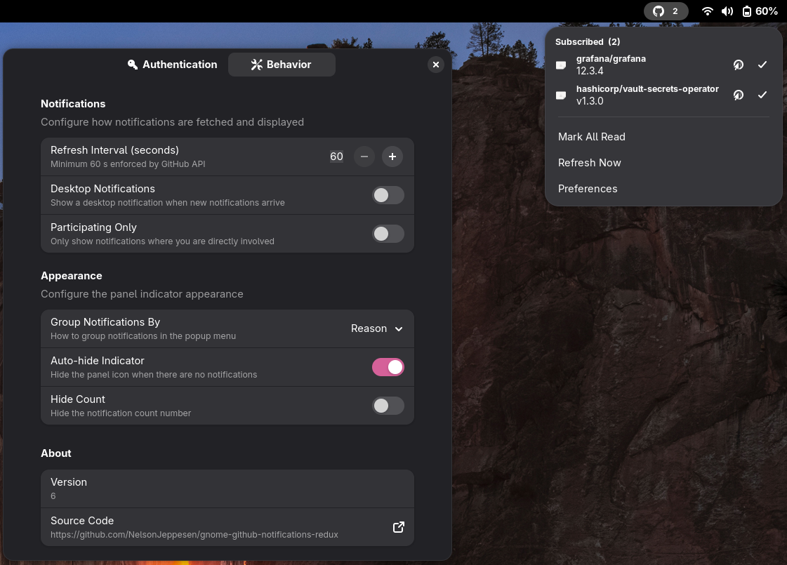

# GitHub Notifications Redux



A GNOME Shell 49 extension that shows your GitHub notification count in the
top panel with a rich popup menu for browsing, opening, and dismissing
individual notifications.

Inspired by
[gnome-github-notifications](https://github.com/alexduf/gnome-github-notifications),
rewritten from scratch for modern GNOME using ESModules, Soup 3.0, and
Adwaita preferences.

## Features

- Notification count badge in the top panel
- Popup menu listing individual notifications (PR, issue, commit, release)
- Open any notification directly in your browser
- Mark single notifications or all notifications as read
- Desktop notifications when new items arrive
- Configurable polling interval (respects GitHub's `X-Poll-Interval` header)
- Participating-only filter
- Auto-hide indicator when inbox is empty
- GitHub Enterprise support (custom hostname)
- Modern Adwaita preferences dialog with connection test button
- Exponential back-off on API errors

## Requirements

- GNOME Shell 49+
- A GitHub personal access token with the **`notifications`** scope

## Installation

### From extensions.gnome.org (recommended)

*(Coming soon)*

### With Nix

```sh
nix build
nix run .#install
```

### Manual

```sh
bash install.sh
```

Then restart GNOME Shell (log out / log in on Wayland) and enable:

```sh
gnome-extensions enable github-notifications-redux@jeppesen.io
```

## Configuration

Open preferences via the popup menu ("Preferences") or run:

```sh
gnome-extensions prefs github-notifications-redux@jeppesen.io
```

### Getting a token

1. Visit <https://github.com/settings/tokens/new?scopes=notifications&description=GNOME+Notifications+Redux>
2. Select **only** the `notifications` scope
3. Generate the token and paste it into the extension preferences

> **GitHub Enterprise**: change the hostname in the Authentication page.

## Development

Enter the dev shell (provides `glib-compile-schemas`, `gjs`, `jq`, etc.):

```sh
nix develop
```

Run all checks (schema validation, JS syntax, metadata, SVG):

```sh
nix flake check
```

Build the extension package and `.zip`:

```sh
nix build
```

### Testing in a nested session

Launch a 1000x1000 nested GNOME Shell with the extension installed:

```sh
bash test-nested.sh              # launch nested session
bash test-nested.sh --prefs      # same, then open the prefs dialog
```

Or via Nix:

```sh
nix run .#test-nested
nix run .#test-nested -- --prefs
```

## Project Structure

```
.
├── extension.js        Main extension module (panel indicator, API polling)
├── prefs.js            Preferences window (Adw/GTK 4, runs in separate process)
├── metadata.json       GNOME Shell extension manifest
├── stylesheet.css      St/CSS styles for the panel indicator and popup menu
├── github-symbolic.svg GitHub logo (symbolic icon for the panel)
├── schemas/
│   └── ...gschema.xml  GSettings schema (token, domain, refresh interval, etc.)
├── install.sh          Quick local install script
├── test-nested.sh      Launch a nested GNOME Shell for testing
├── flake.nix           Nix build, install, check, and dev shell definitions
├── flake.lock          Nix dependency lock file
└── LICENSE             GPL-3.0-or-later
```

## Contributing

See [CONTRIBUTING.md](CONTRIBUTING.md) for development guidelines.

## License

This project is licensed under the
[GNU General Public License v3.0 or later](LICENSE) (GPL-3.0-or-later).
